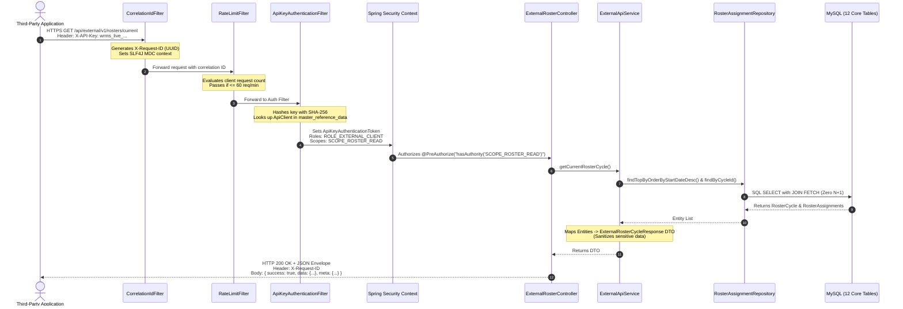

# WRMS External API & Integration Layer — Complete Architecture & Conceptual Guide

**Audience**: Project Owner (Rajat Maurya) & Engineering Team  
**System**: WRMS (Workforce Roster Management System)  
**Version**: v1.0.0 (Batch 60)

---

## 1. 22 Core Concepts Explained Simply

### 1. What is an API?
An **API (Application Programming Interface)** is a formal digital bridge between two computer programs. Just as a human uses a graphical user interface (buttons, menus, screens) to interact with WRMS, another program (like HRMS or an attendance tool) uses an API to ask WRMS for data and receive structured answers.

### 2. What is a REST API?
**REST (Representational State Transfer)** is an industry-standard architectural style for web APIs. It uses the web's standard language (HTTP) to perform operations on resources (such as Rosters, Employees, or Leaves) using standard URLs and methods.

### 3. What is an Endpoint?
An **Endpoint** is a specific web address (URL) hosted by WRMS where a particular piece of data or service is exposed. For example, `https://wrms.app/api/external/v1/rosters/current` is the endpoint to get the current week's roster.

### 4. What is HTTP?
**HTTP (Hypertext Transfer Protocol)** is the foundational communication protocol of the internet. When your browser opens a website or an app calls an API, it sends an HTTP Request over the network, and the server returns an HTTP Response.

### 5. HTTP Methods: GET vs POST vs PUT vs PATCH vs DELETE
HTTP methods define the **action** you want to take:
* **GET**: Read or fetch data (e.g. "Give me the roster for this week"). No changes are made to the database.
* **POST**: Create a brand new record (e.g. "Create a new API client key").
* **PUT**: Replace or update an entire existing record (e.g. "Update all details of a shift").
* **PATCH**: Modify only a specific field of an existing record (e.g. "Change only the active flag to false").
* **DELETE**: Remove or revoke a record (e.g. "Delete an API client key").

### 6. What is JSON?
**JSON (JavaScript Object Notation)** is a lightweight, human-readable text format used to exchange data between systems. For example:
```json
{
  "employeeCode": "EMP001",
  "name": "Rajat Maurya",
  "shift": "MORNING"
}
```

### 7. What is Authentication?
**Authentication (AuthN)** answers: *"Who are you?"*  
It is the process of verifying identity. When a third party provides an API key (`X-API-Key: wrms_live_...`), WRMS checks whether that key is valid and belongs to an active, registered partner.

### 8. What is Authorization?
**Authorization (AuthZ)** answers: *"What are you allowed to do?"*  
Once identity is confirmed, authorization checks if the partner has permission to access the requested resource. For example, a client may be authenticated, but only permitted to read employees, not rosters.

### 9. What is an API Key?
An **API Key** is a long, secret, unique string of characters issued to an application (e.g. `wrms_live_a1b2c3d4e5f6...`). It acts like an unguessable digital passport for machine-to-machine communication without requiring user logins.

### 10. What is a Bearer Token?
A **Bearer Token** is an authorization credential passed in the HTTP `Authorization: Bearer <token>` header. The server accepts that whoever *bears* (holds) the token is authorized to make the request.

### 11. What is JWT?
A **JWT (JSON Web Token)** is a compact, cryptographically signed token containing claims (e.g., username, role, expiration date). WRMS uses JWT internally for employee and admin web sessions.

### 12. What is an API Scope / Permission?
A **Scope** is a specific boundary of access granted to an API key. WRMS supports four core scopes:
* `ROSTER_READ`: Permission to view rosters.
* `EMPLOYEE_READ`: Permission to view employee directory.
* `SHIFT_READ`: Permission to view shift timings.
* `LEAVE_READ`: Permission to view approved leaves.

### 13. What is a DTO?
A **DTO (Data Transfer Object)** is a specialized Java record/class designed purely for carrying data over the network. It defines the exact JSON structure returned to the caller.

### 14. Why should Database Entities NOT be directly exposed?
Exposing JPA entities directly is dangerous because:
1. **Security Leakage**: Database entities contain internal fields like `password`, `user_id`, or internal admin remarks.
2. **Fragility & Breaking Changes**: If you rename a database column tomorrow, third-party integrations will break immediately. A DTO acts as a protective buffer, keeping the external contract stable.

### 15. What is API Versioning?
**API Versioning** places a version indicator in the URL (`/api/external/v1/...`). If WRMS introduces breaking changes in the future, it can release `/api/external/v2/...` while keeping `/v1/` running for existing partners.

### 16. What is OpenAPI?
**OpenAPI** is an industry-standard machine-readable specification format (YAML or JSON) that fully describes REST APIs, their URLs, parameters, headers, and schemas.

### 17. What is Swagger UI?
**Swagger UI** is an interactive web page generated from the OpenAPI specification where developers can read API documentation and test endpoints directly in their browser.

### 18. What is Postman?
**Postman** is a popular desktop and web tool used by software engineers to test APIs, send HTTP requests, and inspect responses.

### 19. What is Rate Limiting?
**Rate Limiting** restricts how many requests a client can make in a given timeframe (e.g. 60 requests/minute). It protects the WRMS server and MySQL database from being overloaded by aggressive or malfunctioning scripts.

### 20. What is CORS?
**CORS (Cross-Origin Resource Sharing)** is a browser security policy that restricts web pages from making requests to a different domain. Server-to-server API calls bypass CORS, but browser-based calls are governed by it.

### 21. What is Audit Logging?
**Audit Logging** is the practice of recording security and operational events (who called which endpoint, at what time, and what HTTP status was returned) so administrators have a complete historical trail.

### 22. How does an external application call WRMS?
An external application (written in Python, Node.js, C#, Java, etc.) uses an HTTP client library to send an HTTPS GET/POST request with the API key in the header to the WRMS server, which returns a JSON response.

---

## 2. Complete Request Flow Diagram



---

## 3. Real Integration Scenario: Weekly Roster Consumption

### Scenario
An external HR Portal wants to fetch the shift schedule every Monday morning at 08:00 AM.

* **Step 1**: The HR admin receives API key: `wrms_live_7a8b9c0d1e2f3a4b5c6d7e8f9a0b1c2d` with scope `ROSTER_READ`.
* **Step 2**: The HR system runs an automated cron job making this HTTP call:

#### Request
```http
GET /api/external/v1/rosters/current HTTP/1.1
Host: wrms-production.up.railway.app
X-API-Key: wrms_live_7a8b9c0d1e2f3a4b5c6d7e8f9a0b1c2d
Accept: application/json
```

#### WRMS Internal Journey
1. `CorrelationIdFilter` assigns `X-Request-ID: 7f41c30e-091a-4d2b-98f5-19e09d1e0811`.
2. `RateLimitFilter` checks request count for this key (1/60 used).
3. `ApiKeyAuthenticationFilter` computes SHA-256 of `wrms_live_...` and matches against `master_reference_data`. Client found with `ROSTER_READ`.
4. `ExternalRosterController` receives the request.
5. `ExternalApiService` executes a single optimized `JOIN FETCH` SQL query against MySQL.
6. The data is transformed into `ExternalRosterCycleResponse`.

#### Response (200 OK)
```json
{
  "success": true,
  "data": {
    "id": 2539,
    "startDate": "2026-09-14",
    "endDate": "2026-09-20",
    "generatedAt": "2026-09-11T18:59:16",
    "assignmentCount": 49,
    "assignments": [
      {
        "id": 1201,
        "date": "2026-09-14",
        "dayOfWeek": "MONDAY",
        "shiftType": "MORNING",
        "employeeCode": "EMP001",
        "employeeName": "Rajat Maurya",
        "weeklyOff": false,
        "onLeave": false
      }
    ]
  },
  "error": null,
  "meta": {
    "timestamp": "2026-09-11T19:00:00",
    "requestId": "7f41c30e-091a-4d2b-98f5-19e09d1e0811",
    "version": "v1"
  }
}
```
The HR portal reads the response and updates its employee shift calendar!
